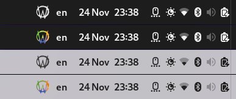
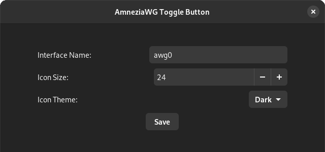

[](https://github.com/amnezia-vpn/toggle-awg-gnome-shell/releases/latest)
[](https://extensions.gnome.org/extension/7580/amneziawg-toggle-button/)
[](https://extensions.gnome.org/extension/7580/amneziawg-toggle-button/)
# Toggle AWG Extension

<div align="center">
    <a href="https://docs.amnezia.org/documentation/amnezia-wg/">
        
    </a>
</div>

A GNOME Shell extension that allows you to toggle the **AWG Quick Service** conveniently from the system status bar. The extension supports custom icons for light and dark themes, which can be manually configured through the preferences.

TODO:
- добавить что требует ядерной реализации
- wrapper that allows you to run AmneziaWG via awg-quick@.service


## Features

- Start/Stop awg-quick Service with a single click.
- Configure the interface name directly in the settings.
- Customizable icons for active/inactive states for both dark and light themes.
- Manual theme selection for icons (dark or light).
- Adjustable icon size.

## Screenshots

### Panel buton



### Settings window



## Gnome Versions Support

 - 43 - `master` branch, `v1` tag

## Manual Installation

### Get extension from GIT:

```bash
git clone https://github.com/amnezia-vpn/toggle-awg-gnome-shell.git ~/.local/share/gnome-shell/extensions/toggle-awg@amnezia-vpn
```
> add `--branch v<version tag>` if you need exact version

### Get extension from ZIP:
```bash
wget https://github.com/amnezia-vpn/toggle-awg-gnome-shell/releases/download/v1/toggle-awg@amnezia-vpn.shell-extension.zip
gnome-extensions install toggle-awg@amnezia-vpn.shell-extension.zip --force
```

> Replace `v1` in url with `v<version tag>` if you need exact version

### Apply extension

1. Restart GNOME Shell
 - *For X11*: press `Alt + F2`, type `r`, and hit `Enter`.
 - *For Wayland*: logout and login again

2. Enable the extension using GNOME Extensions app or with `gnome-extensions enable toggle-awg@amnezia-vpn` command

## Configuration

Open the extension preferences through the GNOME Extensions app to configure the following:

 - *Interface Name*: Specify the system interface name (default is awg0).
 - *Icon Size*: Adjust the size of the icons displayed in the system panel.
 - *Icon Theme*: Choose between dark or light theme icons.

## Work Mechanics

The extension interacts with the systemctl command to manage the AWG Quick Service:

 - *Start*: `sudo systemctl start awg-quick@<interface>`
 - *Stop*: `sudo systemctl stop awg-quick@<interface>`

Ensure that the awg-quick service is properly configured on your system.

TODO: requires sudoers edit

## AmneziaWG client setup

TODO

## License

This project is licensed under the GPL-2.0 License. See the [LICENSE](LICENSE) file for details.

## Contribution

Feel free to open issues or submit pull requests to improve this extension.
